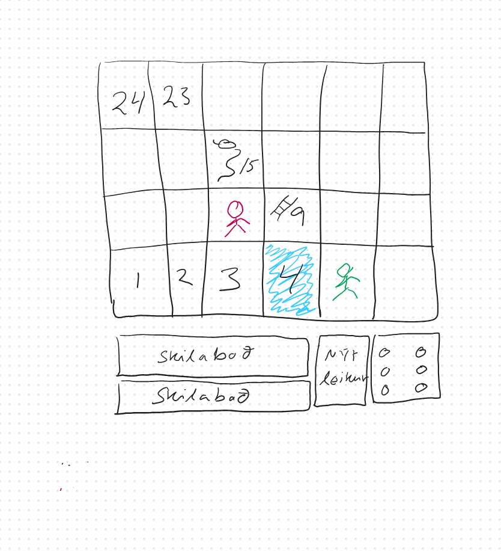

Viðmótsforritun
Verkefni 3 - Slönguspil
Námsmarkmið
Að nemandi:

geti notað Style reglur, Style class og Style sheet við hönnun útlits notendaviðmóts (í .fxml og java forriti)

geti skilgreint gögn í breytum sem eru af Property tagi. Að nemendur geti gert eina breytu háða gildi á annarri með því að skilgreina binding á milli þeirra eða með listeners. 

þekki hlutverk Region klasans og geti notað eiginleika hans (tilviksbreytur) og aðferðir til að breyta t.d. um lögun (e. shape), bakgrunn (background), ramma/jaðar (border), mörk (bounds) o.fl. - hvort sem er í forriti eða .fxml skrá 

geti hannað notendaviðmót og farið eftir hönnunarleiðbeiningum 

Dæmablöð
Það fylgja tvö dæmablöð þessu verkefni Dæmablað 4 3.2 og 10.2

Verkefnið sem á að leysa
Skrifa á einfalt slönguspil (e. Snakes and Ladders) á 4 (raðir) x 6 (dálkar) borði. Reitir á borðinu eru táknaðir með tölustaf, 1 upp í 24 og hafa bakgrunnslit af handahófi, t.d. 3 mögulegir litir.  Skoðið vel hvernig röðin á reitunum er á dæmigerðu slönguspili.   Tveir leikmenn spila spilið og er staða þeirra á borðinu (reitnum) táknuð með sitthvorri myndinni. Leikmenn skiptast á að kasta einum tening. Teningshliðar eru táknaðar með mynd.  Leikmaður kemur í mark ef hann lendir á síðasta reitnum eða ef hann  færist  fram yfir síðasta reitinn. Hvort sem er sést leikmaðurinn á síðasta reitnum.

Sá leikmaður sem kemur fyrst í mark vinnur. Þegar leikmaður kemst í mark er spilinu lokið og getur leikmaður þá ekki kastað tening. Ef leik er lokið getur leikmaður  hafið nýjan leik. Hver reitur getur haft stiga eða slöngu. Síðasti reiturinn hefur hvorki slöngu né stiga. Ef reitur hefur stiga þá færist leikmaður á annan reit ofar á borðinu. Ef reitur hefur slöngu þá færsti leikmaður á reit neðar á borðinu. Forritið getur sett upp slöngur og stiga. 

Gagnvirkniskröfur
1. Notendaviðmót segir hver á að gera næst 

2. Leikmaður kastar tening. Mynd af tölu af handahófi sést á teningnum.

3. Ef leikmaður hefur lent á reit með mynd af slöngu eða stiga er leikmaður látinn vita, t.d. með texta,  í notendaviðmótinu. 

4. Þegar teningi hefur verið kastað færist leikmaður áfram um jafnmarga reiti (-slöngu reiti/+stiga reiti) á borði. Leikmaður er táknaður með mynd á lendingarreitnum. Ef báðir leikmenn eru á sama reitnum, er nóg að sýna annan leikmanninn. 

5. Ef leikmaður lendir á lokareit eða fram yfir hann, gefur kerfið til kynna að leikmaður hafi unnið og að leik sé lokið. Viðmótshlutur sem leyfir notanda að hefja nýjan leik er virkur. Teningurinn verður óvirkur. 

6. Þegar nýr leikur viðmótshlutur er virkjaður fer leikurinn í upphafsstöðu. Teningurinn verður virkur og Hefja leik viðmótshlutur verður óvirkur. 

Útlitskröfur 
Vandið hönnun útlitsins. Farið eftir hönnunarleiðbeiningum 

Hér kemur skissa af útliti 

 

Forritunarkröfur
Hafið tvo pakka (e. package) hi.verkefni.vidmot og hi.verkefni.vinnsla (eða xxx.yyy.vidmot og xxx.yyy.vinnsla má líka vera bara vidmot og vinnsla)
 Notendaviðmóti er lýst í slanga-view.fxml skrá.
Skrifið SlangaController sem er stýringin fyrir notendaviðmótið. Skrifið SlangaApplication sem er klasinn sem ræsir notendaviðmótið og opnar glugga forritsins. 
Hafið vinnsluklasann Leikur sem vísar á aðra vinnsluklasa. Leikur klasinn getur m.a. leikið leik. Vinnsluklasinn Leikmadur geymir stöðu leikmannsins á borðinu (heiltala (IntegerProperty) sem vísar í númer reits) og nafn hans ef vill. Vinnsluklasinn SlongurStigar hefur upplýsingar  um pör af reitum sem slangan eða stiginn er á og lendingarreit sem segir til um hvert slangan eða stiginn leiðir. Hægt er að nota HashMap klasa til að tákna þetta mengi. Vinnsluklasinn Teningur heldur utan um upplýsingar um hver er núverandi tala á teningnum. Klasinn hefur aðferðir eins og kasta sem býr til slembitölu á bilinu 1 til 6 og uppfærir þá núverandi tölu á teningnum. 

Hafið slanga.css skrá með öllum styleClass forritsins. Stýrið útliti með CSS
Notið Properties, binding og listeners til að færa öll gögn úr vinnslu í notendaviðmót. 
allt þetta góða: 
Notist við góðar forritunarvenjur. Hafið aðferðir stuttar. Forðist endurtekinn kóða. Hjálparaðferðir eiga að vera private. Allar tilviksbreytur eiga að vera private og hafa get og set-aðferðir ef á þarf að halda.
Hafið klasa með stórum upphafsstaf og breytur og aðferðir með litlum upphafsstaf.
Skjalið klasana, tilviksbreytur og aðferðir með JavaDoc. aðferð. Sjá einnig hér
Námsmat
Það er gefin einkunn fyrir útlit,  gagnvirkni og forritun. Ef forrit þýðir (e. compile) ekki fæst ekkert fyrir gagnvirkni og forritun. Gætið þess að prófa forritið vel þannig að það krassi ekki.  Verkefnið er einstaklingsverkefni. Forritið það sjálf. 
Hér eru drög að matskvörðum fyrir verkefnið. Með fyrirvara um hugsanlegar breytingar.

Skila

Skilaðu í Gradescope. Sjáðu leiðbeiningar hér.

Klasarnir eru a.m.k. 

SlangaApplication
SlangaController
Leikur
Leikmadur
Teningur
SlongurStigar

Lausnin 
Lausnin verður sett á Git geymslu (repository) HBV201G-Verkefni